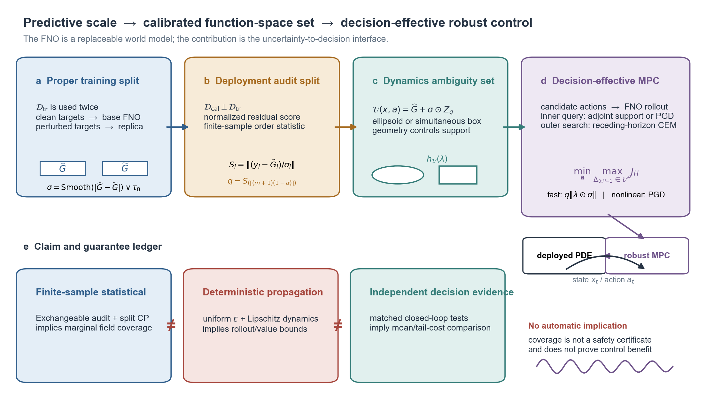

# Decision-Calibrated Robust PDE Control

**From FNO predictive uncertainty to decision-effective dynamics ambiguity sets**

This repository studies one question: how can uncertainty from a Fourier
Neural Operator (FNO) world model be converted into a dynamics ambiguity set
that is useful for robust control?

The contribution is not a new FNO block. The FNO supplies a differentiable
one-step PDE world model. The research contribution is the interface from
prediction to uncertainty, from uncertainty to a calibrated field-valued set,
and from that set to robust model predictive control (MPC).



## Method

For a state field $u_t$, action $a_t$, and observed physical parameters
$\xi_{\mathrm{obs}}$, the residual FNO predicts

$$
\widehat u_{t+1}
=\widehat G_\theta(u_t,a_t,\xi_{\mathrm{obs}})
=u_t+\delta_\theta(u_t,a_t,\xi_{\mathrm{obs}}).
$$

A second FNO uses the same proper-training inputs and Gaussian-perturbed
targets. The smoothed disagreement between the two operators defines a local
scale $\sigma_\theta$. A disjoint deployment-audit split then calibrates either
an anisotropic ellipsoid

$$
\mathcal U_2(u,a)
=\left\lbrace
\widehat G_\theta(u,a)+\Delta:
\left\lVert\Delta\oslash\sigma_\theta(u,a)\right\rVert_{2,n}\le q_2
\right\rbrace,
$$

or a simultaneous coordinate box

$$
\mathcal U_\infty(u,a)
=\left\lbrace
\widehat G_\theta(u,a)+\Delta:
|\Delta_j|\le q_\infty\sigma_{\theta,j}(u,a)\ \text{for every }j
\right\rbrace.
$$

The controller queries the same set through either its exact support function
or a nonlinear adversarial rollout. For the ellipsoid and the normalized
field inner product,

$$
\sup_{\Delta\in\mathcal U_2}
\langle\lambda,\Delta\rangle_n
=q_2\left\lVert\lambda\odot\sigma_\theta\right\rVert_{2,n}.
$$

Split conformal coverage, deterministic error propagation, and closed-loop
performance are evaluated as separate claims. Marginal conformal coverage is
not presented as a safety certificate for counterfactual MPC trajectories.

## Implemented benchmarks

- Controlled one-dimensional viscous Burgers dynamics with an action channel.
- Viscosity, boundary, initial-condition, actuator-gain, and compound shifts.
- A residual FNO with four Fourier blocks and ResNet-style skip connections.
- Clean-label and perturbed-label FNO training.
- Isotropic $L^2$, anisotropic ellipsoidal, and simultaneous box ambiguity sets.
- Nominal, adjoint-robust, and projected-gradient adversarial MPC.
- The official $128\times128$ NeuralOperator Navier--Stokes data as a
  high-dimensional uncertainty benchmark.
- Independent value-gap scaling and value-bound audits.

The public Navier--Stokes pairs contain no action channel. They test
function-valued uncertainty calibration, not two-dimensional closed-loop
control.

## Repository layout

```text
src/unoc/                 PDE simulator, FNO models, calibration, MPC, audits
notebooks/                Portable Jupyter workflow
scripts/                  Data download, result audit, and figure generation
results/                  Burgers metrics and traceable summaries
experiments/              Reference CSV/JSON outputs and standalone figures
theory/                   Error-propagation and robust-control derivations
docs/                     Dataset and experimental-protocol documentation
paper/                    Current preprint PDF
tests/                    Numerical and structural regression tests
```

## Installation

Python 3.10 or newer is required.

```bash
git clone https://github.com/YaowenKANG666/decision-calibrated-pde-control.git
cd decision-calibrated-pde-control
python -m venv .venv
source .venv/bin/activate
python -m pip install --upgrade pip
python -m pip install -e ".[dev]"
```

For the official NeuralOperator dataset loader, install the optional
dependency:

```bash
python -m pip install -e ".[dev,ns2d]"
```

## Reproduce the experiments

A CPU-compatible smoke test is:

```bash
dcurc-experiment --model fno --quick --device cpu --output-dir results/smoke
```

The full controlled-Burgers run is:

```bash
dcurc-experiment \
  --model fno \
  --uncertainty perturbation \
  --control-cases 24 \
  --control-horizon 20 \
  --seed 27 \
  --output-dir results/fno_burgers_seed27
```

The portable notebook
[`notebooks/Decision_Calibrated_PDE_Control.ipynb`](notebooks/Decision_Calibrated_PDE_Control.ipynb)
uses ordinary Python and Jupyter. It detects the repository root, chooses CPU
or CUDA when available, and writes every artifact to project-relative paths.

The NS2D archive is downloaded only when that optional experiment is enabled.
Raw data and large checkpoints are excluded from version control. Dataset
provenance and the expected download are documented in
[`docs/DATASET.md`](docs/DATASET.md).

## Ablation protocol

The paper reports three controlled ablation groups. Within each group, all
variants use identical evaluation cases and differ only in the named factor.

| Group | Fixed within the group | Varied factor |
|---|---|---|
| Calibration and geometry | trained FNO pair, scale rule, 90% target, 800 compound-shift transitions | source versus deployment calibration; $L^2$ tube versus ellipsoid versus box |
| Robust-control interface | trained FNO pair, 24 matched plants, initial field, horizon, CEM seeds | nominal planning, ambiguity geometry, adjoint support, or adversarial rollout |
| Value-bound construction | 60 calibration and 160 test trajectories, horizon 20, $\gamma=0.95$, 90% value-level target | global maximum, local recursion, adjoint support, or adjoint plus curvature |

These are conditional, within-run ablations. They isolate mechanism but do not
replace a multi-seed population study. Full settings are recorded in
[`docs/EXPERIMENT_PROTOCOL.md`](docs/EXPERIMENT_PROTOCOL.md).

## Reference results

The main Burgers result uses one seed and 24 matched actuator-gain cases. Lower
closed-loop cost is better.

| Controller | Mean cost | Change from nominal | Empirical p90 | Change from nominal |
|---|---:|---:|---:|---:|
| Nominal MPC | 0.5797 | - | 1.0752 | - |
| Source-$L^2$ robust MPC | 0.5724 | -1.27% | 1.0250 | -4.66% |
| Audit-$L^2$ robust MPC | 0.5686 | -1.92% | 0.9914 | -7.79% |
| Ellipsoid-adjoint MPC | 0.5747 | -0.88% | 1.0201 | -5.12% |
| Box-adjoint MPC | 0.5688 | -1.89% | 0.9586 | -10.84% |
| Adversarial ellipsoid MPC | 0.5764 | -0.58% | 1.0532 | -2.04% |

The NS2D FNO obtained a mean field RMSE of 0.1635, simultaneous test
coverage of 0.883 at a nominal 0.90 level, and a mean full band width of
4.3409. The disagreement scale had weak pointwise error association
($r=0.169$), so this benchmark is reported as a negative tightness result.

All displayed numbers are checked against saved JSON and CSV files by:

```bash
python scripts/audit_release_results.py
```

The generated report is available at
[`results/data_integrity/DATA_AUDIT.md`](results/data_integrity/DATA_AUDIT.md).

## Theory boundary

If a uniform one-step bound holds on the relevant region,

$$
\left\lVert G_\star(x,a)-\widehat G(x,a)\right\rVert\le\epsilon,
$$

and the dynamics are $L_G$-Lipschitz, then

$$
e_h\le\epsilon\sum_{k=0}^{h-1}L_G^k.
$$

With an $L_r$-Lipschitz reward and $\gamma L_G<1$, the policy-transfer term is

$$
V_G^{\pi^\star}-V_G^{\widehat\pi}
\le
\frac{2\gamma L_r\epsilon}
{(1-\gamma)(1-\gamma L_G)}
+\delta_{\mathrm{opt}}.
$$

For $L_G\le1$, this has the target
$O\!\left(\epsilon/(1-\gamma)^2\right)$ dependence. This deterministic theorem
uses a uniform error assumption; marginal conformal coverage does not imply it.

## Scientific status

This repository is a research prototype. The current evidence supports a
mechanism-level claim: calibrated field geometry can change robust-control
decisions and their empirical tail cost. It does not establish universal
controller superiority, global safety, grid-independent coverage, or a
population-level effect across training seeds.

The current preprint is available at
[`paper/decision_calibrated_robust_control.pdf`](paper/decision_calibrated_robust_control.pdf).

## License

MIT.
